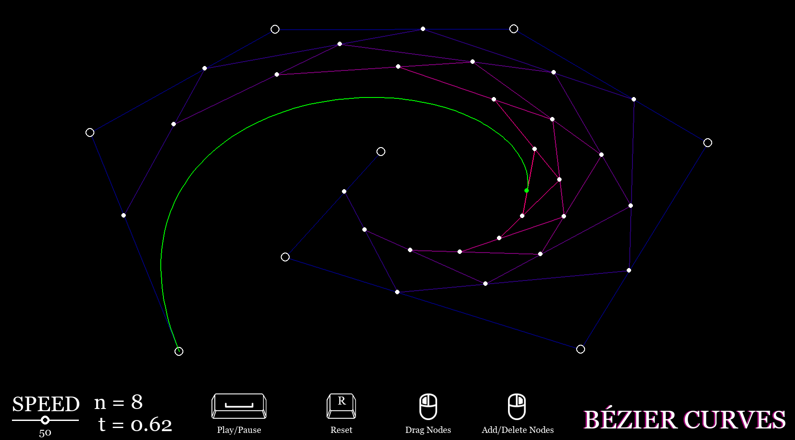

# Bézier Curves Visualization
A real-time interactive visualization of how bézier curves are modelled. This project was inspired by [The Beauty of Bézier Curves](https://www.youtube.com/watch?v=aVwxzDHniEw&t=1260s) by Freya Holmér.

Creating this visualization was very significant to me because I was able to apply concepts I learned in CS classes to bring a vision to life. After being inspired by Freya Holmér's video, I wanted to implement my own version of bézier curves. By applying my newfound knowledge and doing additional research, I was able to create a visually pleasing project that I am happy with.  

# Controls
- **Space Bar:** play / pause the visualization
- **R:** reset the visualization
- **Left Click:** drag nodes around the visualization
- **Right Click:** click on empty space to CREATE a node, click on a pre-existing node to DELETE it
- **Ctrl+S:** saves the state of the current bézier curve in a .txt file
- **Ctrl+O:** opens a saved bézier curve
